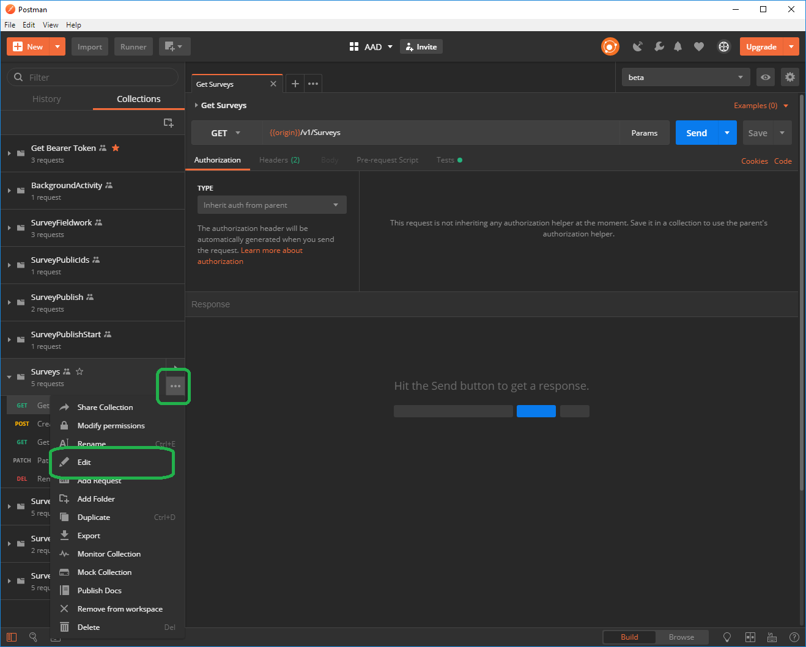
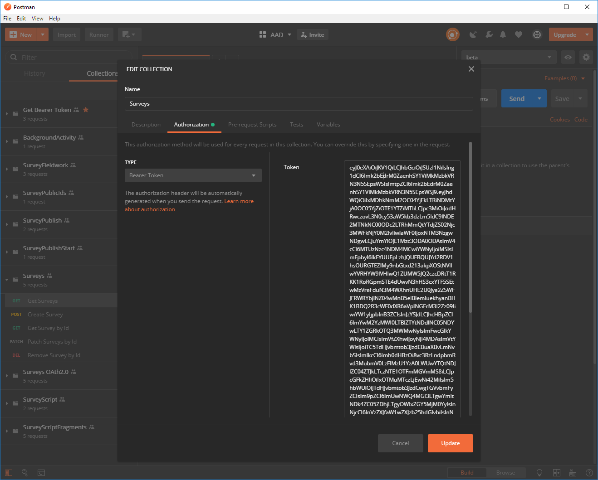
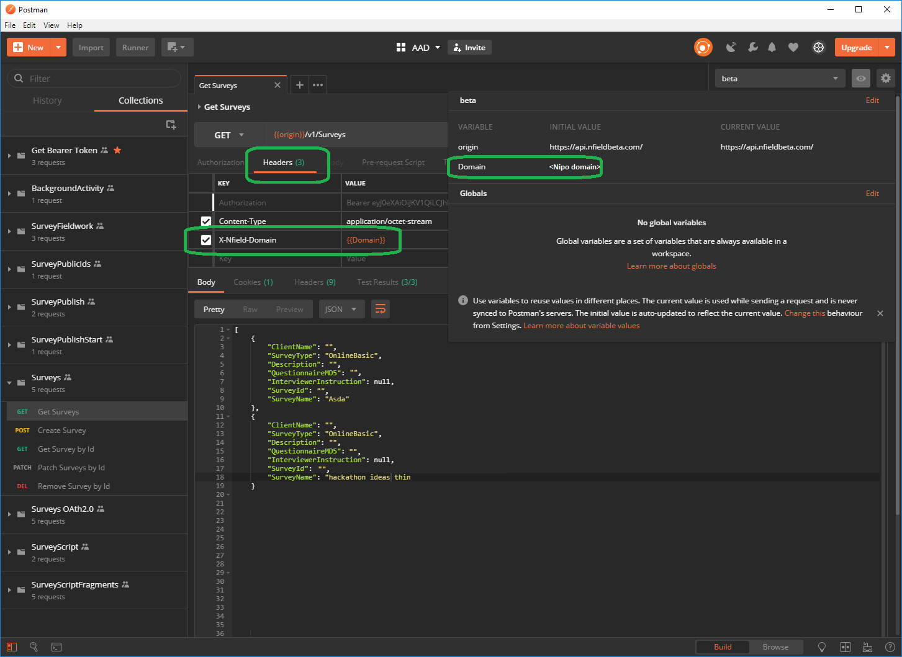

# AAD Authentication

We recently added support for AAD (Office 365) authentication to the Nfield API. To
use this from within NIPO, you can follow these steps.

## Download the ADTokenHelper tool

This tool can be found
[here](https://ktglbuc.sharepoint.com/sites/niposoftware/Shared%20Documents/Forms/AllItems.aspx?id=%2Fsites%2Fniposoftware%2FShared%20Documents%2FTools%20and%20Installers%2FADTokenHelper).
You need to download all the files, or the program won't work. You can
double-click the executable to get a token. This token will be copied to your
clipboard. Note that tokens expire at some point. When that happens you can
just double-click the executable again to get a new one.

## Using Postman

The collections in this folder use AAD Authentication.
On the `Authorization` tab of each request, the authorization type is set to `Inherent auth from parent`.
In the collection folder, click `...` and then `Edit` to edit the collection, see screenshot below.

*Figure 1. Edit the collection*

On the `Authorization` tab, the option `Bearer Token` is selected.
In the `Token` textbox, you should paste the token you got from the ADTokenHelper tool.

*Figure 2. Paste the Bearer Token*

You can now update and close the collection.

## Access

On the `Headers` tab of the request, there should be an entry with key `X-Nfield-Domain` and value `{{Domain}}`.
Verify in the `Environment quick look` (the eye ball in the upper right corner) if the environment contains a variable for `Domain`. 

*Figure 3. Paste the Bearer Token*
